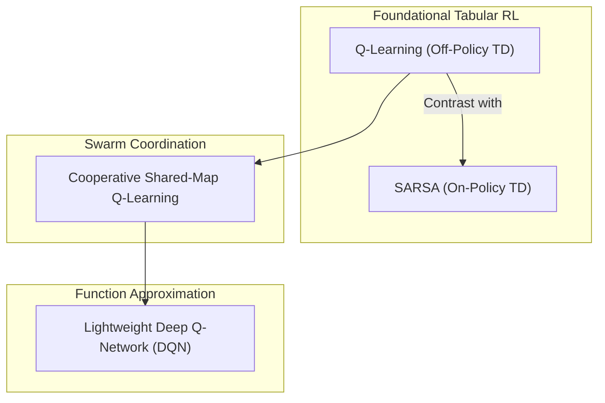

# Reinforcement Learning for Swarm Robotics: Collective Mapping and Hazard Detection

**Course Project Specification & Theoretical Framework**  
**Course:** Reinforcement Learning  
**Domain:** Multi-Agent Reinforcement Learning (MARL), Decentralized Exploration, Hazard Mitigation  

---

## 1. Executive Summary & Project Motivation

Autonomous robotic swarms offer robust, scalable, and fault-tolerant solutions for dangerous real-world applications such as disaster response, planetary exploration, underground mine surveying, and chemical/radiation leak assessment. In these scenarios:
1. **The environment is unknown *a priori***: Robots have no prior map; they must explore and construct an occupancy grid collectively under partial observability ("fog of war").
2. **Hazards are dispersed throughout**: Toxic spills, structural collapses, or extreme heat zones must be detected, localized, and flagged without putting the entire swarm at risk.
3. **Decentralized coordination is required**: Centralized control suffers from single-point failure and communication bottlenecks. Individual agents must make autonomous decisions while cooperating toward a shared objective.

This project formulates **Swarm Robotic Mapping and Hazard Detection** as a **Decentralized Partially Observable Markov Decision Process (Dec-POMDP)**. We apply and benchmark intuitive, foundational Reinforcement Learning (RL) algorithms:
- **Independent Q-Learning (IQL)** (Off-policy Temporal Difference)
- **SARSA** (On-policy Temporal Difference, Hazard-Sensitive)
- **Cooperative Shared-Map Q-Learning** (Information-Sharing Multi-Agent RL)
- **Lightweight Deep Q-Network (DQN)** (Deep Value Approximation)

The algorithms are intentionally designed to be mathematically rigorous yet accessible, transparent, and computationally tractable for educational demonstration and simulation.

---

## 2. Problem Formulation: Dec-POMDP

### 2.1 Formal Definition
The multi-agent system consists of $N$ homogeneous robots operating in a discrete 2D grid world $\mathcal{W}$ of size $W \times H$. The environment contains:
- **Free navigable cells**: $\mathcal{C}_{free}$
- **Static obstacles/walls**: $\mathcal{C}_{obstacle}$
- **Hazard zones**: $\mathcal{C}_{hazard}$ (localized danger zones that damage or penalize agents)
- **Unexplored cells**: Initially, the entire world is covered in "fog of war" except the agents' initial starting radius.

The problem is formalized as a tuple $\langle \mathcal{N}, \mathcal{S}, \{\mathcal{A}_i\}, \mathcal{P}, \{\mathcal{R}_i\}, \{\Omega_i\}, \mathcal{O}, \gamma \rangle$:
- $\mathcal{N} = \{1, 2, \dots, N\}$ is the set of $N$ swarm agents.
- $\mathcal{S}$ is the true global state of the environment (all robot positions, obstacle locations, hazard locations, and global map coverage).
- $\mathcal{A}_i$ is the discrete action space for agent $i$.
- $\mathcal{P}(s' \mid s, \mathbf{a})$ is the state transition probability function given joint action $\mathbf{a} = (a_1, \dots, a_N)$.
- $\mathcal{R}_i$ is the reward received by agent $i$.
- $\Omega_i$ is the local observation space for agent $i$.
- $\mathcal{O}(s, i) \to o_i \in \Omega_i$ is the observation function mapping the true state to local sensory readings.
- $\gamma \in [0, 1)$ is the temporal discount factor.

---

## 3. State, Action, and Reward Engineering

To prevent the **Curse of Dimensionality** (which causes tabular RL to fail when $N$ agents move across a $W \times H$ grid), each robot maps its high-dimensional local sensor window into a compact, discrete feature state vector.

```
       Local Sensor Range (r_sensor = 2)
       [ .  .  #  .  . ]
       [ .  H  .  .  . ]  -> Features extracted:
       [ .  .  R  .  . ]     1. Frontier Direction (where unexplored cells lie)
       [ .  .  .  .  . ]     2. Obstacle Proximity (N, S, E, W walls)
       [ .  .  .  .  . ]     3. Hazard Presence (safe vs danger detected)
                             4. Neighbor Density (crowding signal)
```

### 3.1 State Representation ($s_i$)
Each agent $i$ at step $t$ observes:
1. **Frontier Quadrant ($d_{frontier} \in \{0, 1, 2, 3, 4\}$)**:
   The relative direction containing the highest concentration of unexplored cells within sensing range:
   - $0$: North, $1$: East, $2$: South, $3$: West, $4$: None / Fully Mapped Locally.
2. **Obstacle Proximity ($w_N, w_E, w_S, w_W \in \{0, 1\}^4$)**:
   Four binary flags indicating if an impassable obstacle or boundary is directly adjacent in each cardinal direction ($2^4 = 16$ states).
3. **Hazard Sensor ($h_{local} \in \{0, 1\}$)**:
   A binary reading indicating if a hazard is detected within the immediate sensing footprint.
4. **Swarm Density ($c_{crowd} \in \{0, 1\}$)**:
   Whether another robot is within collision/interference proximity ($d \le 1$).

$$\text{Total Tabular States} = 5 \times 16 \times 2 \times 2 = 320 \text{ discrete states}$$

This compact representation allows tabular Q-learning and SARSA to converge rapidly (in hundreds of episodes) while maintaining full interpretability.

---

### 3.2 Action Space ($\mathcal{A}_i$)
Each agent has 5 discrete actions:
$$\mathcal{A}_i = \{0: \text{Move North}, 1: \text{Move East}, 2: \text{Move South}, 3: \text{Move West}, 4: \text{Stay / Scan Hazard}\}$$

If a movement action leads to an obstacle or world boundary, the agent remains in place and receives a collision penalty.

---

### 3.3 Reward Function ($\mathcal{R}_i$)
The reward function balances four competing objectives: **Exploration**, **Hazard Detection**, **Safety**, and **Swarm Dispersion**.

$$r_t^{(i)} = r_{explore} + r_{hazard} + r_{collision} + r_{cohesion} + r_{step}$$

| Reward Component | Value | Mathematical Definition / Condition | Rationale |
| :--- | :---: | :--- | :--- |
| **Exploration Gain** | $+10.0 \times \Delta M_i$ | $\Delta M_i = \text{new cells revealed by agent } i$ | Directly incentivizes clearing the "fog of war". |
| **Hazard Detection** | $+25.0$ | Agent discovers an unflagged hazard cell | High incentive to locate and catalog danger zones. |
| **Hazard Collision** | $-20.0$ | Agent steps directly into a hazard cell | Teaches caution and avoidance of dangerous terrain. |
| **Obstacle Collision**| $-5.0$ | Agent attempts to step into a wall/boundary | Prevents wasting time against obstacles. |
| **Crowding Penalty** | $-2.0$ | $\sum_{j \ne i} \mathbb{I}(\|p_i - p_j\|_1 \le 1) > 0$ | Discourages redundant overlapping exploration. |
| **Step Cost** | $-0.1$ | Every step taken | Encourages time-efficient trajectories. |

---

## 4. Reinforcement Learning Algorithms

We select four algorithms that progress from fundamental tabular TD learning to cooperative multi-agent coordination and deep value estimation.



---

### 4.1 Algorithm 1: Independent Q-Learning (IQL)
**Class:** Off-policy, Model-free, Temporal Difference (TD) Control.

In Independent Q-Learning, each robot maintains its own action-value table $Q_i(s, a)$. The Bellman optimality equation guides the updates:

$$Q_i(s_t, a_t) \leftarrow Q_i(s_t, a_t) + \alpha \left[ r_{t+1} + \gamma \max_{a'} Q_i(s_{t+1}, a') - Q_i(s_t, a_t) \right]$$

- **$\alpha \in (0, 1]$**: Learning rate (step-size).
- **$\gamma \in [0, 1)$**: Discount factor for future rewards.
- **Action Selection**: $\epsilon$-greedy policy:
  $$a_t = \begin{cases} \text{random action} \in \mathcal{A}, & \text{with probability } \epsilon \\ \arg\max_a Q_i(s_t, a), & \text{with probability } 1 - \epsilon \end{cases}$$
- **Characteristics in Swarm Mapping**:
  - Independent agents treat other moving robots as part of the dynamic environment.
  - Because it takes $\max_{a'} Q(s', a')$, it assumes optimal future actions, resulting in aggressive exploration.

---

### 4.2 Algorithm 2: SARSA (State-Action-Reward-State-Action)
**Class:** On-policy, Model-free, Temporal Difference Control.

SARSA updates the Q-table based on the action actually selected by the current policy (including exploratory moves):

$$Q_i(s_t, a_t) \leftarrow Q_i(s_t, a_t) + \alpha \left[ r_{t+1} + \gamma Q_i(s_{t+1}, a_{t+1}) - Q_i(s_t, a_t) \right]$$

where $a_{t+1} \sim \pi(s_{t+1})$ is sampled from the agent's $\epsilon$-greedy policy.

#### Why compare Q-Learning vs SARSA in Hazard Detection?
This is a classic RL pedagogy insight (Cliff Walking problem analog):
- **Q-Learning** learns the optimal policy path (which may skirt right next to a hazard zone because theoretically it won't step in). However, during $\epsilon$-greedy exploration, random steps cause frequent fatal hazard collisions.
- **SARSA** accounts for its own exploration noise ($\epsilon$). It realizes that walking adjacent to a hazard poses a risk of accidentally stepping into it, so it learns a **safer, wider berth around hazards**.
- In an academic project, demonstrating this safety margin between Q-Learning and SARSA provides a compelling comparative result.

---

### 4.3 Algorithm 3: Cooperative Shared-Map Q-Learning
**Class:** Cooperative Multi-Agent Reinforcement Learning with Shared Information.

Pure independent learning can lead to duplicate coverage (multiple robots exploring the same corner). In Cooperative Shared-Map Q-Learning:
1. **Global Collective Occupancy Grid ($\mathcal{M}_{swarm}$)**:
   Every time agent $i$ senses a cell $(x, y)$, it updates the shared swarm map:
   $$\mathcal{M}_{swarm}(x, y) \leftarrow \text{Occupied / Free / Hazard}$$
2. **Frontier-Augmented State**:
   Each agent computes its frontier vector with respect to the **collective** map $\mathcal{M}_{swarm}$, not just its private history. If Robot A maps Sector 1, Robot B's state immediately reflects that Sector 1 is known, naturally steering Robot B toward unexplored Sector 2.
3. **Cooperative Shared Experience**:
   Agents periodically synchronize or average their Q-tables (Federated Q-Learning update):
   $$\bar{Q}(s, a) = \frac{1}{N} \sum_{i=1}^N Q_i(s, a)$$
   This shares lessons learned about hazard patterns and wall configurations across the entire fleet.

---

### 4.4 Algorithm 4: Lightweight Deep Q-Network (DQN)
**Class:** Value Function Approximation via Neural Networks.

To demonstrate how the system scales beyond tabular states to raw sensory grids, we implement a lightweight 2-layer MLP Q-network:
- **Input**: Continuous/flattened local observation vector $\mathbf{x} \in \mathbb{R}^{d_{obs}}$.
- **Architecture**:
  $$\text{Input}(d_{obs}) \longrightarrow \text{Linear}(64) \longrightarrow \text{ReLU} \longrightarrow \text{Linear}(32) \longrightarrow \text{ReLU} \longrightarrow \text{Linear}(|\mathcal{A}|)$$
- **Loss Function**: Mean Squared Bellman Error with Experience Replay:
  $$\mathcal{L}(\theta) = \mathbb{E}_{(s, a, r, s')} \left[ \left( r + \gamma \max_{a'} Q(s', a'; \theta^-) - Q(s, a; \theta) \right)^2 \right]$$
  where $\theta^-$ represents the parameters of a periodically updated Target Network.

---

## 5. Comparative Algorithm Matrix

| Metric / Dimension | Independent Q-Learning (IQL) | SARSA | Cooperative Shared-Map Q | Deep Q-Network (DQN) |
| :--- | :--- | :--- | :--- | :--- |
| **Policy Type** | Off-policy | On-policy | Off-policy (Team) | Off-policy |
| **Update Target** | $\max_{a'} Q(s', a')$ | $Q(s', a')$ (sampled) | Shared $\max_{a'} Q(s', a')$ | Target Net $\max_{a'} Q(s', a'; \theta^-)$ |
| **Hazard Safety** | Aggressive (closer to hazards) | Conservative (safer buffer) | Moderate (coordinated) | Learned smooth safety margin |
| **Coordination** | Implicit | Implicit | Explicit (via map & Q-sync) | Implicit / Shared Replay |
| **Complexity** | Very Low ($O(1)$ lookup) | Very Low ($O(1)$ lookup) | Low ($O(N)$ sync) | Medium (Backprop) |
| **Interpretability** | 100% (Inspectable table) | 100% (Inspectable table) | 100% (Inspectable table) | Latent weights |

---

## 6. Collective Mapping & Hazard Sensing Architecture

### 6.1 Occupancy Grid Formulation
The environment is discretized into a 2D grid:
$$\mathcal{M}(x, y) \in \{-1: \text{Unexplored}, 0: \text{Free Space}, 1: \text{Obstacle}, 2: \text{Detected Hazard}\}$$

At $t = 0$:
$$\mathcal{M}_0(x, y) = -1 \quad \forall (x, y)$$

When robot $i$ with position $(x_i, y_i)$ activates its sensor radius $R_{sensor}$:
1. All visible cells in Euclidean radius $\le R_{sensor}$ are queried.
2. Obstacles block line-of-sight (Bresenham raycasting or grid radius).
3. If a hazard cell is detected, $\mathcal{M}(x,y)$ is updated to $2$, and an alert is broadcast to the swarm.

### 6.2 Frontier Detection
Frontiers are cells on the boundary between explored free space ($\mathcal{M}=0$) and unexplored territory ($\mathcal{M}=-1$). The swarm's exploration efficiency is maximized by guiding agents toward high-density frontier clusters.

---

## 7. Experimental Evaluation Metrics

In the simulation, every training run records:
1. **Map Coverage Ratio ($\mathcal{C}_{map}$)**:
   $$\mathcal{C}_{map}(t) = \frac{\sum_{x,y} \mathbb{I}(\mathcal{M}_t(x, y) \ne -1)}{\text{Total Navigable Cells}} \times 100\%$$
2. **Hazard Detection Rate ($\mathcal{H}_{recall}$)**:
   $$\mathcal{H}_{recall}(t) = \frac{\text{Hazards Discovered by Swarm}}{\text{Total Ground-Truth Hazards}} \times 100\%$$
3. **Hazard Collision Count ($K_{danger}$)**:
   Total number of hazardous steps incurred across all robots (evaluates safety of SARSA vs Q-learning).
4. **Time-to-90% Coverage ($T_{90}$)**:
   Step number at which $90\%$ of the map is unveiled.
5. **Redundancy Index**:
   Number of duplicate cell visits across agents.

---

## 8. Summary of Implementation Modules

The companion simulation software provides a fully self-contained codebase:
- `environment.py`: Grid world with procedural hazards, obstacles, and occupancy grid.
- `agent.py`: Robot agent with sensor suite (rangefinder, hazard detector, frontier extractor).
- `algorithms/`:
  - `q_learning.py`: Tabular IQL.
  - `sarsa.py`: On-policy risk-aware SARSA.
  - `cooperative_q.py`: Shared-map team Q-learning.
  - `dqn.py`: PyTorch Deep Q-Network.
- `simulation.py`: Multi-episode training and automated benchmarking harness.
- `visualize_matplotlib.py`: Multi-panel visualization with real-time rendering.
- `web_viewer.html`: Interactive in-browser swarm simulator with live canvas rendering.
